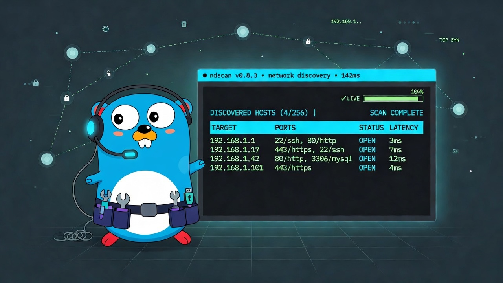
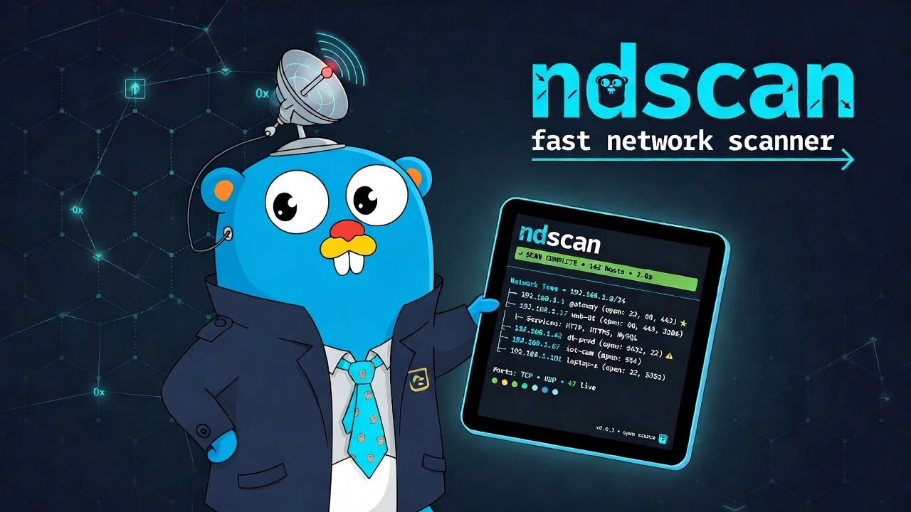

# ndscan



A fast, modern **CLI + interactive TUI** for network discovery. A friendly wrapper around `nmap` that makes everyday scanning quicker and more pleasant — with beautiful output, rich reports, and the ability to run scans locally or through an SSH jump host.

**Install globally with one command:**

```bash
curl -fsSL https://raw.githubusercontent.com/Emre-Diricanli/ndscan/main/install.sh | bash
```

---

## Features

- **Interactive TUI** (`ndscan` or `ndscan tui`) — form-driven scanning, live progress, table/tree views, filtering, sorting, detail inspection, and one-key exports.
- **Powerful CLI** (`ndscan scan`) — scriptable and great for CI/automation.
- **Table view** (`--tb` / `--view table`) — clean, compact list of hosts and open ports.
- **Tree view** (`--tr` / `--view tree`) — full hierarchical breakdown including hostnames, MACs, vendors, and services.
- **MAC + vendor lookup** (`--show-mac --show-vendors`).
- **Remote scanning** — `user@host` syntax runs the scan on a remote machine over SSH.
- **Rich reports** — `--report results.md` or `--report report.html` with exposure/risk findings.
- **Multiple export formats** — JSON, CSV, Markdown, HTML (from both CLI and TUI).
- **Built-in risk intelligence** — surfaces potentially dangerous open services.
- **Flexible presets** — `quick`, `default`, `udp`, `deep` (or specify custom ports).
- **Sudo / privileged mode** support for better ARP and SYN scan results.

---

## Demo



---

## Installation

### One-line install (recommended)

The fastest way to install ndscan globally:

```bash
curl -fsSL https://raw.githubusercontent.com/Emre-Diricanli/ndscan/main/install.sh | bash
```

This will:
- Detect your OS and architecture (macOS/Linux + amd64/arm64)
- Download the latest pre-built binary from GitHub Releases
- Install it to `/usr/local/bin` (using `sudo` if needed)

After installation, `ndscan` will be available globally.

You can also pin a specific version:

```bash
curl -fsSL https://raw.githubusercontent.com/Emre-Diricanli/ndscan/main/install.sh | VERSION=v0.2.0 bash
```

Or install to a user-writable location:

```bash
curl -fsSL https://raw.githubusercontent.com/Emre-Diricanli/ndscan/main/install.sh | INSTALL_DIR=$HOME/.local/bin bash
```

> **Note:** The one-line installer requires at least one published GitHub Release with pre-built binaries (created via GoReleaser). Until the first release is published, use the "From source" method below.

### From source

```bash
git clone https://github.com/Emre-Diricanli/ndscan.git
cd ndscan
make build
sudo mv ndscan /usr/local/bin/
```

Or install via Go (this puts it in your Go bin directory):

```bash
go install github.com/Emre-Diricanli/ndscan/cmd/ndscan@latest
```

Make sure `$(go env GOPATH)/bin` (or `$GOBIN`) is in your `PATH`.

### Requirements

- `nmap` installed on any machine you want to scan **from** (local or the SSH jump host)
  - macOS: `brew install nmap`
  - Linux: `sudo apt install nmap` / `sudo dnf install nmap` etc.
- For best ARP/MAC/SYN scan results on local scans: use the `--sudo` flag (or run as root)

### For maintainers: releases and versioning

Releases are automatic: every push to `main` bumps the **patch** version (`v0.1.0` → `v0.1.1` → …), tags the commit, and publishes a GitHub Release via GoReleaser (`.github/workflows/auto-version.yml`). To merge without releasing, include `[skip release]` in the commit message.

For a **minor/major** bump (a big overhaul), push the tag yourself — auto-bumping resumes from it (next commit becomes `v0.2.1`):

```bash
git tag -a v0.2.0 -m "Release v0.2.0"
git push origin v0.2.0
```

Human-pushed tags are built and published by `.github/workflows/release.yml`.

---

## Quick Start

Launch the beautiful interactive TUI:

```bash
ndscan
# or
ndscan tui
```

Run a quick scan from the command line:

```bash
ndscan scan 192.168.1.0/24 --tb
```

Scan with MAC addresses and vendors, and save a nice HTML report:

```bash
ndscan scan 192.168.1.0/24 --show-mac --show-vendors --report scan-report.html
```

Scan through a jump host:

```bash
ndscan scan user@203.0.113.10 192.168.10.0/24 -tb --show-mac
```

---

## Interactive TUI

Running `ndscan` with no arguments opens a full-screen terminal UI powered by Bubble Tea:

- Enter targets and tweak options in a friendly form
- Watch live host discovery and port scanning progress
- Toggle between table and tree views on the fly (`t`)
- Filter (`/`) and sort (`s` — by IP, hostname, open-port count, or state)
- Press `enter` on a host to run a **Discover deep-scan** — service versions, OS detection, TLS certificate and HTTP-title details, and one-key opening of web UIs (`o`)
- See per-host latency at a glance — RTT and a speed-tier column (`>>>` / `>>` / `>`)
- Track changes between scans — a `Δ` column flags `NEW`/`GONE` hosts and opened/closed ports compared to the previous scan of the same targets
- Export results instantly with single keys:
  - `e` → JSON
  - `c` → CSV
  - `m` → Markdown report
  - `h` → HTML report (opens automatically in your browser)
- Save and load scan profiles (`ctrl+s` to save, `ctrl+p` to pick)
- **Watch mode** (`w`) — re-scan on an interval (adjust with `+` / `-`), with optional desktop notifications (`b`) when hosts or ports change

Exports are saved to `~/Downloads/ndscan/<date>/`.

The TUI is the fastest way to explore a network interactively.

---

## CLI Usage

```bash
ndscan scan [user@remote] <targets...> [flags]
```

### Common Examples

**Quick local scan (table view)**

```bash
ndscan scan 192.168.1.0/24 -tb
```

**Detailed tree view with MACs + vendors**

```bash
ndscan scan 192.168.1.0/24 -tr --show-mac --show-vendors
```

**Custom ports + deep preset + HTML report**

```bash
ndscan scan 10.0.0.0/24 -P deep -p 1-10000 --report results.html
```

**Remote scan via SSH + JSON output**

```bash
ndscan scan admin@scanner.internal 192.168.50.0/24 --json results.json
```

**Privileged scan (SYN + ARP)**

```bash
ndscan scan 192.168.1.0/24 --sudo --show-mac --show-vendors
```

---

## Reports

ndscan can generate polished, shareable reports:

```bash
ndscan scan 192.168.1.0/24 --show-mac --show-vendors --report report.html
ndscan scan 10.0.0.0/24 --report findings.md
```

- `.html` → full standalone HTML document (opens in your browser automatically; pass `--no-open` to skip)
- `.md`  → clean GitHub-flavored Markdown

Reports include:
- Scan metadata and summary stats
- Full host/port table with services
- **Exposure section** highlighting risky open ports (high / warn severity) with reasons

---

## Flags

| Flag                | Description                                                      |
|---------------------|------------------------------------------------------------------|
| `-tb`               | Shortcut for `--view table`                                      |
| `-tr`               | Shortcut for `--view tree`                                       |
| `-P, --preset`      | Scan preset: `quick` (default), `default`, `udp`, `deep`         |
| `--discover`        | Only list live hosts (skip the port scan) — fastest             |
| `-p, --ports`       | Custom ports (e.g. `22,80,443` or `1-1024`)                      |
| `--view`            | Force view: `table` or `tree`                                    |
| `--show-mac`        | Include MAC addresses (L2 only)                                  |
| `--show-vendors`    | Include vendor names (requires `--show-mac`)                     |
| `--sudo`            | Run local nmap via sudo (better ARP, SYN scans, MAC discovery)   |
| `--root-scan`       | Use SYN scan (`-sS`) — requires root on the scanning machine     |
| `-j, --json`        | Write results to a JSON file                                     |
| `--report`          | Write Markdown or HTML report (format from file extension)       |
| `--no-open`         | Don't open HTML reports in the browser                           |
| `--concurrency`     | Max parallel host scans (default 64; auto-capped to host count) |
| `--host-timeout`    | Per-host timeout in seconds (default 20)                         |

> **Note on MAC/vendor enrichment:** ARP-based host and MAC discovery is IPv4-only, and ARP fallback only applies to literal IP/CIDR targets (e.g. `192.168.1.0/24`) — hostname targets skip it.

---

## Vendor Lookup

ndscan includes a small built-in OUI database. For better vendor names, place your own file at:

```
~/.ndscan/oui.txt
```

Format (tab or space separated):

```
00:11:22   AcmeCorp
3C:5A:B4   TP-Link
48:5A:3F   Cisco
```

---

## Example Output

**Table view (`-tb`)**

```
+----------------+----------------+-----+----------------------+
| IP             | HOST           | UP  | OPEN PORTS           |
+----------------+----------------+-----+----------------------+
| 192.168.1.1    | _gateway       | yes | 53, 80, 8080, 8443   |
| 192.168.1.200  |                | yes | 22                   |
+----------------+----------------+-----+----------------------+
```

**Tree view (`-tr`)**

```
192.168.1.1
├─ Host: _gateway
├─ Up: yes
├─ MAC: 48:5A:3F:12:34:56
├─ Vendor: Cisco
└─ Ports:
   ├─ 53/tcp domain
   ├─ 80/tcp http
   └─ 8443/tcp https-alt
```

---

## Roadmap

- `--ssh-sudo` flag for automatic sudo on jump hosts
- Lightweight built-in port scanner for ultra-fast sweeps (no nmap dependency)
- Service banner grabbing (SSH/HTTP)
- More export templates and theming for HTML reports

---

## Contributing

Contributions are welcome! Feel free to open issues or pull requests.

Some areas that would be especially helpful:
- Additional scan presets or smarter defaults
- Improved risk rules
- Better remote/SSH UX
- Documentation and examples

---

## License

ndscan is released under the [MIT License](LICENSE).

---

**Made with Go and the official Go Gopher.**
